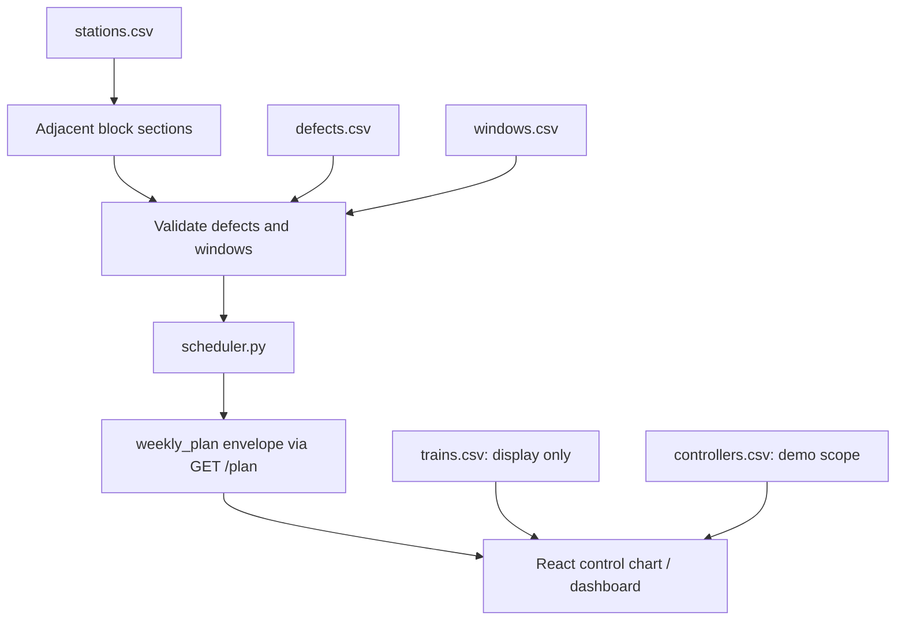

# SCHEMA.md — NIYOJ shared data contract

**SIH26027 · Team ShadowStrikerz**

This document preserves the original prototype contract. Sections 1–11 describe the baseline; section 12 proposes optional NIYOJ extensions. No existing CSV column, enum, or API key is renamed or removed. Proposed extensions are not evidence of implementation. See [README.md](README.md) for the project overview.

This file is the source of truth for the shared data structure. Coordinate contract changes before changing producers or consumers.

Demo scope: **one Control Board**, one route of **100–200 km**, **20–30 stations**. Use real railway terminology: the stretch between two *adjacent* stations is a **block section** — that's your `corridor` unit everywhere below, not an arbitrary Km range.

---

## 1. `stations.csv` — route reference, read by everyone

| column | type | example | notes |
|---|---|---|---|
| `station_id` | string | `STN01` | unique |
| `name` | string | `Rampur` | |
| `km_marker` | float | `12.5` | distance from route start |
| `sequence` | int | `1` | order along the route, 1 to ~25 |

A **block section** is any two adjacent stations by `sequence`: `STN01`–`STN02`, `STN02`–`STN03`, etc. Write `corridor` as `"STN04-STN05"` (or `"Rampur-Sitapur"` if you want it human-readable — pick one, use it everywhere). Derive this list from `stations.csv`, using the same adjacency rule in the backend and frontend rather than separate hand-typed constants. Preserve the corridor representation already used consistently by the repository; do not change it as part of this documentation update. The examples below use station IDs.

> **Control-chart orientation:** `sequence` drives station placement along the chart's **horizontal (X) axis**, left → right, not top-to-bottom. (An earlier draft described this as the Y-axis / vertical — that's been corrected here.)

The station rows below are an excerpt. A complete demo dataset must include every station referenced by defects, windows, trains, and controllers. All examples in this document are illustrative.

### Example

```csv
station_id,name,km_marker,sequence
STN01,Rampur,0,1
STN02,Sitapur,8.2,2
STN03,Devgarh,15.6,3
STN04,Narayanpur,23.1,4
STN05,Kishanganj,31.4,5
```

---

## 2. `defects.csv` — scheduler input

| column | type | example | notes |
|---|---|---|---|
| `task_id` | string | `T001` | unique |
| `corridor` | string | `STN04-STN05` | must be an adjacent pair from `stations.csv` |
| `department` | enum | `Track` \| `Signal` \| `Power` | |
| `description` | string | `Rail crack repair` | |
| `urgency` | int (1–5) | `4` | 5 = most urgent |
| `overdue_days` | int | `12` | 0 if not overdue |
| `estimated_hours` | float | `1.5` | how long the repair takes |

### Example

```csv
task_id,corridor,department,description,urgency,overdue_days,estimated_hours
T001,STN04-STN05,Track,Rail crack repair,4,12,1.5
T002,STN10-STN11,Signal,Signal relay fault,5,3,2
T003,STN18-STN19,Power,OHE insulator damage,3,0,1
```

---

## 3. `windows.csv` — scheduler input

Baseline times use local railway time (Asia/Kolkata). Each window begins and ends on its stated date, with `start_time < end_time`. Overnight windows such as `23:00–01:00` are not supported by this date/time shape without an explicit overnight convention and code changes. Do not silently interpret them as same-day windows. Supplied windows are candidate planning inputs, not proof of live operational clearance.

| column | type | example | notes |
|---|---|---|---|
| `window_id` | string | `W014` | unique |
| `corridor` | string | `STN04-STN05` | must be an adjacent pair from `stations.csv` |
| `date` | string | `2026-09-14` | `YYYY-MM-DD` |
| `start_time` | string | `00:00` | 24hr `HH:MM` |
| `end_time` | string | `03:00` | 24hr `HH:MM` |

### Example

```csv
window_id,corridor,date,start_time,end_time
W014,STN04-STN05,2026-09-14,00:00,03:00
W015,STN10-STN11,2026-09-14,01:00,02:30
W016,STN18-STN19,2026-09-15,00:00,01:30
```

---

## 4. `trains.csv` — control-chart input (not a baseline scheduler input)

In the baseline this is presentation data only — it does not feed `scheduler.py`. It exists purely to draw trains on the control chart and to provide visual context. Displaying trains does not mean the scheduler has checked train conflicts or derived the windows from a timetable.

| column | type | example | notes |
|---|---|---|---|
| `train_id` | string | `12301` | |
| `name` | string | `Rajdhani Express` | optional, for tooltips |
| `type` | enum | `Express` \| `Passenger` \| `Freight` | Freight per the problem statement's "goods forecast" |
| `direction` | enum | `UP` \| `DOWN` | pick one convention (e.g. UP = increasing `sequence`) and note it in the legend |
| `corridor` | string | `STN04-STN05` | which block section |
| `date` | string | `2026-09-14` | |
| `entry_time` | string | `05:40` | when it enters this block section |
| `exit_time` | string | `05:52` | when it clears this block section |

### Example

```csv
train_id,name,type,direction,corridor,date,entry_time,exit_time
12301,Rajdhani Express,Express,UP,STN04-STN05,2026-09-14,05:40,05:52
54211,Local Passenger,Passenger,DOWN,STN10-STN11,2026-09-14,06:10,06:19
```

---

## 5. `controllers.csv` — small lookup used for the mock "login", not a real auth table

| column | type | example | notes |
|---|---|---|---|
| `controller_id` | string | `CTRL01` | what they type in to "log in" — no password needed |
| `name` | string | `A. Sharma` | |
| `control_board` | string | `Board A` | |
| `start_station` / `end_station` | string | `STN01` / `STN25` | the fixed route this controller owns |

On "login," look up the ID, load their `start_station`–`end_station` range, and route straight into the control-chart pre-scoped to it. There's no picker to browse other boards — the scope comes from who logged in, for the demo workflow. One row is enough for your demo; a second can demonstrate UI scoping, but this is not an authentication or access-control guarantee.

### Example

```csv
controller_id,name,control_board,start_station,end_station
CTRL01,A. Sharma,Board A,STN01,STN25
```

---

## 6. `weekly_plan` — written by `scheduler.py`, served by `GET /plan`, read by the frontend

Returned as JSON, wrapped in an envelope so the frontend always knows what it's looking at:

```json
{
  "granularity": "weekly",
  "generated_at": "2026-09-14T06:00:00Z",
  "plan": [
    {
      "task_id": "T001",
      "corridor": "STN04-STN05",
      "department": "Track",
      "date": "2026-09-14",
      "assigned_start": "00:00",
      "assigned_end": "01:30",
      "window_id": "W014",
      "priority_score": 0.87,
      "status": "scheduled"
    }
  ],
  "unscheduled": [
    { "task_id": "T002", "corridor": "STN10-STN11", "department": "Signal", "reason": "task requires 120 minutes; available window is 90 minutes" }
  ]
}
```

| field | type | notes |
|---|---|---|
| `task_id` | string | matches `defects.csv` |
| `corridor` | string | an adjacent station pair from `stations.csv` |
| `department` | enum | `Track` \| `Signal` \| `Power` |
| `date` | string | `YYYY-MM-DD` |
| `assigned_start` / `assigned_end` | string | `HH:MM`, within the matched window |
| `window_id` | string | which window it landed in, matches `windows.csv` |
| `priority_score` | float (0–1) | output of the scoring formula |
| `status` | enum | `scheduled` \| `unscheduled` |

**Monthly plan uses the exact same row shape.** To generate a monthly plan, run the scheduler over an actual 4–5 week input horizon and set `"granularity": "monthly"`. A weekly plan uses a rolling 7-day horizon. The frontend may group monthly results by week, but relabelling or regrouping seven days of results does not create a monthly plan. No second row schema is needed.

**`GET /plan` query params (optional, only add if you need them):** `?corridor=STN04-STN05&department=Track&granularity=weekly`. For the demo dataset size, client-side filtering of one full response is enough — skip these unless you have time to spare.

### Complete example (using the tasks and windows above)

```json
{
  "granularity": "weekly",
  "generated_at": "2026-09-14T06:00:00Z",
  "plan": [
    {
      "task_id": "T001",
      "corridor": "STN04-STN05",
      "department": "Track",
      "date": "2026-09-14",
      "assigned_start": "00:00",
      "assigned_end": "01:30",
      "window_id": "W014",
      "priority_score": 0.87,
      "status": "scheduled"
    },
    {
      "task_id": "T003",
      "corridor": "STN18-STN19",
      "department": "Power",
      "date": "2026-09-15",
      "assigned_start": "00:00",
      "assigned_end": "01:00",
      "window_id": "W016",
      "priority_score": 0.55,
      "status": "scheduled"
    }
  ],
  "unscheduled": [
    {
      "task_id": "T002",
      "corridor": "STN10-STN11",
      "department": "Signal",
      "reason": "task requires 120 minutes; available window is 90 minutes"
    }
  ]
}
```

Scores are illustrative; the implemented scorer determines actual values. `scheduled` means assigned in a proposed plan, not sanctioned for execution. Items in `plan` use `status: "scheduled"`; items in `unscheduled` retain the existing minimal shape with `reason` and no required `status` field.

---

## 7. API Response

The backend `GET /plan` endpoint returns exactly the envelope shown above — same field names, no renaming, no unwrapping the `plan` array.

```http
GET /plan
```

Response: identical shape to the "Complete example" in section 6. The React frontend reads `response.plan` for the row list and `response.unscheduled` for the leftover-tasks panel — it should not need to reshape either array before rendering.

---

## 8. Priority Score

`priority_score` is a float between `0` and `1`.

```text
0 = lowest priority
1 = highest priority
```

The exact priority formula belongs to `scheduler.py`. The frontend only **displays** the score — it never calculates or re-derives it.

---

## 9. Data Flow



---

## 10. Team Rules

1. This file is the **single source of truth** for the data structure.
2. Do not rename fields without discussing it with the team first — a two-minute heads-up, not a silent commit.
3. Do not change field types without updating this file.
4. Backend and frontend must use the same field names — no renaming on either side.
5. `corridor` is always an adjacent station pair generated from `stations.csv`, never a hand-typed Km range.
6. Fake/demo data must follow this schema.
7. `scheduler.py` produces the final `weekly_plan` envelope; the frontend consumes it and does not decide scheduling logic.
8. `trains.csv` remains presentation-only in the baseline. A future timetable/white-space engine requires an explicit implementation change; this document does not silently enable it.

---

## 11. MVP Scope

For the first working prototype, the system needs:

1. Load `stations.csv` and derive adjacent block sections.
2. Load and validate `defects.csv` and `windows.csv`.
3. Run `scheduler.py` to produce the `weekly_plan` envelope.
4. Serve it through `GET /plan`.
5. Render scheduled and unscheduled tasks in the React interface.

`trains.csv` and `controllers.csv` can be layered on once the core scheduling loop works — they're not required for the first scheduling demo. A database is **not required** for the initial MVP; CSV/JSON files on disk are enough.

---

*Changing a field name or type here is a two-minute heads-up to the group, not a silent commit.*

## 12. NIYOJ extensions — proposed, optional, and additive

The expanded NIYOJ design adds track-level planning and decision explanations. Keep the baseline working while implementing these capabilities. **Do not add required columns to the five existing CSV files or required keys to the existing `/plan` response.**

### 12.1 Terminology and department mapping

The blueprint uses “corridor” for a larger route. The prototype already uses `corridor` for one adjacent station pair. Preserve the code meaning: any future route-level object must have a separate `route_id`; do not repurpose `corridor` or replace it with `section_id`.

| Existing value | Display label | Expected source-system mapping |
|---|---|---|
| `Track` | Engineering / Track | TMS |
| `Signal` | Signal & Telecommunication | SMMS |
| `Power` | Traction Distribution / Power | TDMS |

These mappings are labels, not evidence of an integration. Record whether a source-system label is mapped from demo data or obtained from an actual source record.

### 12.2 Separate extension file

When extension work begins, use an optional `niyoj_context.json` alongside the CSV files. The existing scheduler does not need to read it. This is a proposed extension contract to implement deliberately, not a required input for the current prototype.

| Top-level key | Type | Purpose |
|---|---|---|
| `schema_version` | string | Start with `"niyoj-context-1"` |
| `tracks` | array | Physical or simulated tracks within existing corridors |
| `task_metadata` | array | Additional provenance and model features, joined by `task_id` |
| `window_tracks` | array | Explicit track scope for a window, joined by `window_id` |
| `decisions` | array | Explanation records tied to tasks and a specific plan generation |

Each track needs `track_id`, `corridor`, and `data_origin` (`synthetic` or `verified`). Task metadata needs `task_id`, `source_system`, and `data_origin`; optional `criticality` must use a documented 1–5 scale. Each window-track mapping needs `window_id` and `track_id`, with matching corridors.

Do not infer that an unmapped section-level window is available independently on every track. If track data is missing, retain baseline section-level scheduling. New physical-track claims require explicit track assignments and occupancy checks.

An illustrative file, with no decision records yet:

```json
{
  "schema_version": "niyoj-context-1",
  "tracks": [
    {
      "track_id": "STN04-STN05-TRK1",
      "corridor": "STN04-STN05",
      "data_origin": "synthetic"
    }
  ],
  "task_metadata": [
    {
      "task_id": "T001",
      "source_system": "TMS",
      "data_origin": "synthetic",
      "criticality": 4
    }
  ],
  "window_tracks": [
    {
      "window_id": "W014",
      "track_id": "STN04-STN05-TRK1"
    }
  ],
  "decisions": []
}
```

Missing extension data must not prevent baseline scheduling. Missing risk or delay inputs must produce unavailable estimates, not invented values or zero costs.

### 12.3 Shared decision record

The proposed `decisions` array holds one reusable explanation record per evaluated task/candidate decision. Use existing IDs rather than introducing a replacement `defect_id`.

| Field | Type | Meaning |
|---|---|---|
| `decision_id` | string | Unique record ID |
| `plan_generated_at` | string | Exact `generated_at` of the plan being explained |
| `task_id` | string | Existing task reference |
| `window_id` | string or null | Candidate/selected window, if any |
| `track_id` | string or null | Explicit track reference, if known |
| `source_system` | string | `TMS`, `SMMS`, or `TDMS`; provenance retained in task metadata |
| `model_used` | string | Actual model/version or `fallback-formula` |
| `priority_score` | number | Same 0–1 score used for the task in that plan |
| `components` | object | `severity`, `overdue_days`, `criticality`, `failure_risk`; unknown values are null |
| `expected_downtime_hours_if_deferred` | number or null | Estimate with documented method and deferral horizon |
| `punctuality_cost_minutes` | number or null | Estimated additional train delay for the evaluated window |
| `recommended_action` | string | `grant`, `defer`, or `reject`; advisory only |
| `rule_cited` | array of strings | Verified rule references or clearly labelled demo constraints actually checked |
| `explanation` | string | Plain-language reason and material assumptions |
| `timestamp` | string | UTC ISO 8601 timestamp |

`components.severity` reuses `urgency` (1–5); it does not require renaming the CSV column. `overdue_days` retains its original unit. `criticality` is an optional 1–5 feature. `failure_risk`, when available, must identify its meaning; only validated probabilistic outputs may be described as failure probabilities. Components are input/risk values, not automatically model feature-attribution scores.

Keep the priority badge, justification log, and future controller-review context tied to the same `decision_id`. Controller actions must be recorded separately from recommendations, with actor, action, reason, timestamp, and the referenced decision. Do not extend the existing task `status` enum to carry approval states.

For now, `/plan` remains unchanged. Exposing decision records through a new endpoint or optional response extension requires implementation and consumer review; no such endpoint is claimed here.

### 12.4 Scheduling and validation requirements

These are acceptance criteria to check in code, not a statement that the current implementation already enforces every check:

- IDs are unique within their reference tables; corridor endpoints exist and are adjacent by `sequence`.
- `urgency` is an integer from 1–5, `overdue_days` is a non-negative integer, and `estimated_hours` is finite and positive.
- Dates and times parse correctly. Baseline windows and train movements use same-day intervals; UTC is used for `generated_at` and decision timestamps.
- Assigned duration covers `estimated_hours`. If scheduling in whole minutes, round required duration upward rather than shortening work.
- An assignment matches the task and window corridor and lies entirely within the window. Overlapping source windows do not create extra infrastructure capacity.
- Each baseline task is either scheduled once or listed once as unscheduled with a reason. Task splitting needs a separate future design.
- Prevent conflicting assignments to the same infrastructure. Do not allow overlapping departmental work merely because departments differ.
- Shared possessions require explicit compatibility, work/isolation requirements, and a possession grouping record. Until that logic exists, schedule work sequentially. Do not count concurrent task-hours as possession duration.
- A greedy fallback and a CP-SAT result must pass the same configured validator. If optimisation fails, use a validated fallback or return an explained partial/empty plan; never guarantee that every input is feasible.
- Replanning must identify the new plan generation and invalidate stale decision context. Synthetic disruptions and cached demonstration results must be labelled.

### 12.5 Inputs still needed for the expanded design

The current CSVs do not contain enough information to substantiate failure-risk forecasts, cascading-delay estimates, or railway-rule compliance. Add the relevant source data and validation before claiming those features:

| Planned capability | Additional evidence or inputs needed |
|---|---|
| GBR prioritisation | Defined prediction target, training provenance, feature definitions, evaluation results, model version, and fallback behaviour |
| Asset-risk estimates | Deferral horizon, calibrated risk if using probability, failure/recovery assumptions, and downtime estimation method |
| Timetable-derived availability | Track assignments, train occupancy, running/stopping times, headways, clearance margins, restrictions, and relevant allowances |
| Delay-cost estimates | Defined baseline timetable and a documented propagation/buffer model |
| Shared possessions | Work compatibility, isolation requirements, and explicit grouping/resource constraints |
| Operational rule checks | Verified applicable rules, their scope, and encoded checks; demo constraints must be labelled as demo constraints |

Timetable allowances alone are not a maintenance window. Derive availability from occupancy and applicable constraints. Compare delay minutes and downtime hours with their units visible; combining them into one objective requires an explicit weighting or conversion policy.

The baseline remains usable without these additions. Implement each extension only when its input data, scheduling behaviour, and explanation can be demonstrated together.
